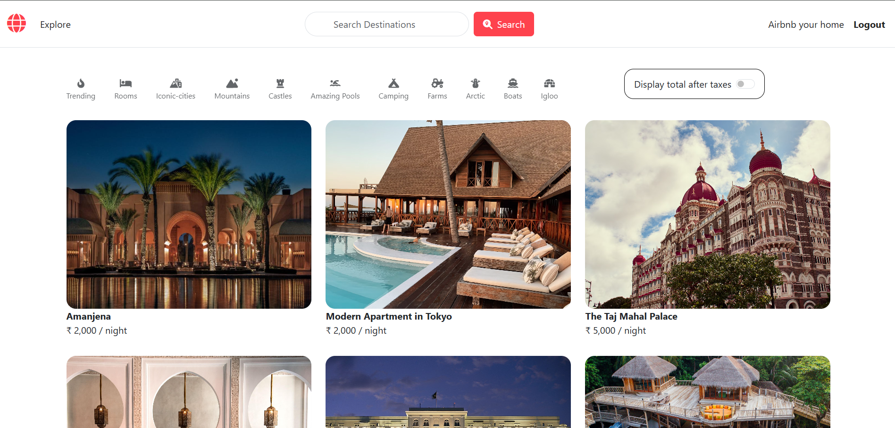

<h1>AxisTrips</h1>
<h2>Main Landing Page</h2>

<h2>Description</h2>
<h3>Tools and Technologies used :</h3>

Node js,Express js, MongoDB, MongoDB Atlas, Cloudinary,Bootstraps

<h3>More...</h3>

<b>MVC Framework</b> :Model(DataBase functionaltiy), Views(Frontend Functionality,Controller(Core Backend Functionality) used for implementing design pattern for Listings.

<h3>Libraries and Middlewares used: </h3>

<b>Express-router :</b> Seggregate related paths and <b>Express-Sessions :</b> create session cookie

<b>cookies parser :</b> for authorization 

<b>Mongoose middleware: </b> Pre->before query executes ,post-after query execution 

<b>Login middleware :</b> for login functionality

<b>Passport :</b> Passport is express compatible authentication middleware of nodejs, provides salting and hashing functionalities, {in our project hashing algo used is pbdkf2}

<b>cloudinary v2+ multer-storage-cloudinary :</b> To parse the multipart form data 

<b>dotenv package ;</b> for .env file that stores credentials we use in code but donot share.

